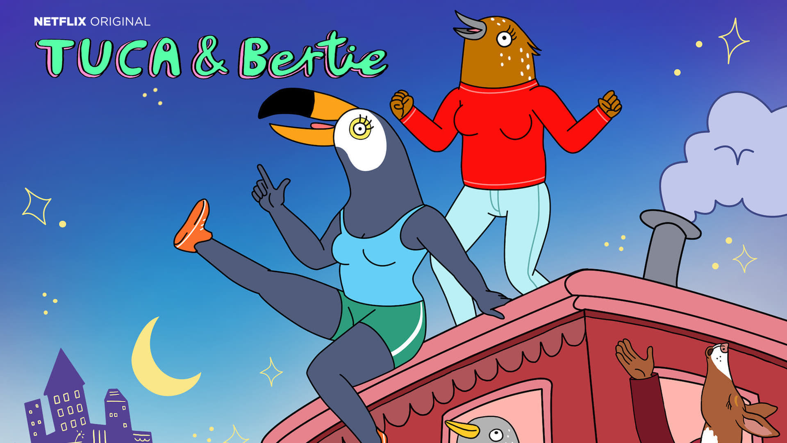

These are some of my favorite TV Shows, movies, artists, podcasts, and more.

## Severance (TV Show)

[Watch on Apple TV+](https://tv.apple.com/us/show/severance/umc.cmc.1srk2goyh2q2zdxcx605w8vtx) – [IMDB](https://www.imdb.com/title/tt11280740/)

"Who are you?" is the thesis of this psy-fi story that explores a world where people can choose to have their minds surgically split between their work lives and home lives. If you like puzzle box shows like Westworld or Lost, you'll enjoy Severance. Where Westworld explored themes of intelligence and consciousness, Severance explores themes of emotion and identity.

I specifically like the tone and aesthetic of Lumon's mind-numbing severed floor – the labyrinthian lab-rat hallways, the pastel color palette that vaguely resembles a mental hospital, and the way the company handbook is strangely written like scripture. Watch the opening credits below to get a sense of this show's surreal vibe.

<iframe width="560" height="315" src="https://www.youtube-nocookie.com/embed/NmS3m0OG-Ug" title="YouTube video player" frameborder="0" allow="accelerometer; autoplay; clipboard-write; encrypted-media; gyroscope; picture-in-picture" allowfullscreen></iframe>

## Do By Friday (Podcast)

[dobyfriday.com](https://dobyfriday.com) – [Listen On Apple Podcasts](https://itunes.apple.com/us/podcast/do-by-friday/id1169249168) – [Support on Patreon](https://www.patreon.com/dobyfriday)

This talk-radio-style Podcast is the highlight of my week. In a single episode, Merlin Mann and Alex Cox might cover productivity tips, politics, things that infuriate them, their personal landlord drama, a recent TV show, and the secret weird things they do. 

Honestly, it's hard to pitch the appeal of this strange and hyperactive podcast, and they lean on a lot of inside jokes and callbacks that won't make sense to new listeners. You'll either like it or you won't.

## Tuca and Bertie (TV Show)

[Season 1 on Netflix](https://www.netflix.com/title/80198137) [Season 2+ on Adult Swim](https://www.adultswim.com/videos/tuca-bertie) – [IMDB](https://www.imdb.com/title/tt8036272/?ref_=nv_sr_srsg_0)

Cute animated comedy about two best friends living in the big city. If you vibe with Broad City on Comedy Central, give this show a shot. I like this show a lot because it feels very personal to me (and Bailey, too) – in fact it feels *so* personal, that we have a running joke in our house that the writers must have hidden cameras in our house to get material for the show.

## Scott Pilgrim vs The World (Movie)

[Where to watch](https://www.justwatch.com/us/movie/scott-pilgrim-vs-the-world) – [IMDB](https://www.imdb.com/title/tt0446029/)

I love the fast-pace of this movie, coupled with the magical realism of video game fights happening in real life. (I'm also crushing on both Ramona Flowers and Wallace Wells)

## Symphonic Metal Bands

Symphonic metal bands blend orchestral instruments and operatic vocals with shredding metal guitars, pulsating drums, and guttural roars. Below is a list of symphonic metal bands I enjoy, with an album that I like.

### Epica

[Spotify](https://open.spotify.com/artist/5HA5aLY3jJV7eimXWkRBBp) – [Apple Music](https://music.apple.com/us/artist/epica/185933496)

<iframe style="border-radius:12px" src="https://open.spotify.com/embed/album/4Hb5cbP4Z9H9G1HavAra4q?utm_source=generator" width="100%" height="240" frameBorder="0" allowfullscreen="" allow="autoplay; clipboard-write; encrypted-media; fullscreen; picture-in-picture"></iframe>

### Edenbridge

[Spotify](https://open.spotify.com/artist/4kRllkt5ryNVBqFinVjBQZ?si=eGc-kjemRl-ibtnfO7V58g) – [Apple Music](https://music.apple.com/us/artist/edenbridge/125552515)

<iframe style="border-radius:12px" src="https://open.spotify.com/embed/album/4lEWkXk1BC4hz2gP5Xmjh6?utm_source=generator" width="100%" height="240" frameBorder="0" allowfullscreen="" allow="autoplay; clipboard-write; encrypted-media; fullscreen; picture-in-picture"></iframe>

### Visions of Atlantis

[Spotify](https://open.spotify.com/artist/5kanN1nKzrkW1m2gZmo82x?si=UP18_ugeTTqHlVz3NdoOjw) - [Apple Music](https://music.apple.com/us/artist/visions-of-atlantis/47709744)

<iframe style="border-radius:12px" src="https://open.spotify.com/embed/album/5cEM9L33SZRTHnSCGooL8E?utm_source=generator" width="100%" height="240" frameBorder="0" allowfullscreen="" allow="autoplay; clipboard-write; encrypted-media; fullscreen; picture-in-picture"></iframe>

### Sonata Arctica

[Spotify](https://open.spotify.com/artist/5YeoQ1L71cXDMpSpqxOjfH?si=t7kEVyqhQCK_H-JjYX5QCw) - [Apple Music](https://music.apple.com/us/artist/sonata-arctica/29048370)

<iframe style="border-radius:12px" src="https://open.spotify.com/embed/album/0HEpZQ4ZtS8GkEJeYNdaKX?utm_source=generator" width="100%" height="240" frameBorder="0" allowfullscreen="" allow="autoplay; clipboard-write; encrypted-media; fullscreen; picture-in-picture"></iframe>

### Xandria

[Spotify](https://open.spotify.com/artist/1jzIEzXVJ4p1kFDmio6LEL?si=FdQFLWhnSDq9sJpYqZjGCw) – [Apple Music](https://music.apple.com/us/artist/xandria/76752772)

<iframe style="border-radius:12px" src="https://open.spotify.com/embed/album/6XTVN27YNrwXutBeNlvkar?utm_source=generator" width="100%" height="240" frameBorder="0" allowfullscreen="" allow="autoplay; clipboard-write; encrypted-media; fullscreen; picture-in-picture"></iframe>

## Electroswing Bands

Electro swing blends the jazzy style of the 1920's with synthesizers and loops.

### Caravan Palace

[Spotify](https://open.spotify.com/artist/37J1PlAkhRK7yrZUtqaUpQ?si=VV_plf1ZREq1rl-uqdQsoQ) - [Apple Music](https://music.apple.com/us/artist/caravan-palace/293238693)

<iframe style="border-radius:12px" src="https://open.spotify.com/embed/album/4DrZfbV5FB2Hwzpq6rwArp?utm_source=generator" width="100%" height="240" frameBorder="0" allowfullscreen="" allow="autoplay; clipboard-write; encrypted-media; fullscreen; picture-in-picture"></iframe>

### Parov Stelar

[Spotify](https://open.spotify.com/artist/65EXuYHVoehCKqp0kOS6px?si=vIf-3gYqRQuEBRuQcT_OXQ) - [Apple Music](https://music.apple.com/us/artist/parov-stelar/62288424)

<iframe style="border-radius:12px" src="https://open.spotify.com/embed/album/16JKaH8bbRjZnmbmxtydp5?utm_source=generator" width="100%" height="240" frameBorder="0" allowfullscreen="" allow="autoplay; clipboard-write; encrypted-media; fullscreen; picture-in-picture"></iframe>

## Darksynth

Electronic music with dark melodies

### Master Boot Record

[Spotify](https://open.spotify.com/artist/77s5NAGQbxu8oLstaqSwHE?si=XSNkE-tTS_CKBUSIUQCvkA) – [Apple Music](https://music.apple.com/us/artist/master-boot-record/1216150815)

This artist stands out because some instruments sound like spinning-platter hard drives

<iframe style="border-radius:12px" src="https://open.spotify.com/embed/album/1ymuJCekHsFQpPFHw9nsy3?utm_source=generator" width="100%" height="240" frameBorder="0" allowfullscreen="" allow="autoplay; clipboard-write; encrypted-media; fullscreen; picture-in-picture"></iframe>

### Carpenter Brut

[Spotify](https://open.spotify.com/artist/1l2oLiukA9i5jEtIyNWIEP?si=A4Pyoxh0Rn61W1U6y8sELg) – [Apple Music](https://music.apple.com/us/artist/carpenter-brut/593656958)

<iframe style="border-radius:12px" src="https://open.spotify.com/embed/album/0io5pe55YRCTVqEjwlOBdN?utm_source=generator" width="100%" height="240" frameBorder="0" allowfullscreen="" allow="autoplay; clipboard-write; encrypted-media; fullscreen; picture-in-picture"></iframe>

### Perturbator

[Spotify](https://open.spotify.com/artist/244uLu9lkdw39BJwlul3k8?si=JTgjMH2mRn-LXh0p-5qxyQ) – [Apple Music](https://music.apple.com/us/artist/perturbator/548930485)

<iframe style="border-radius:12px" src="https://open.spotify.com/embed/album/1P0XIILJzTc9SzkZe4QutA?utm_source=generator" width="100%" height="240" frameBorder="0" allowfullscreen="" allow="autoplay; clipboard-write; encrypted-media; fullscreen; picture-in-picture"></iframe>

### nightride.fm (Online Radio)

[nightride.fm](https://nightride.fm/)

Not an artist, but included here anyway because I often like to listen to this while I work. They have a number of stations with different sub-genres of synthwave music.